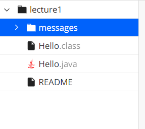
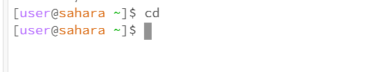
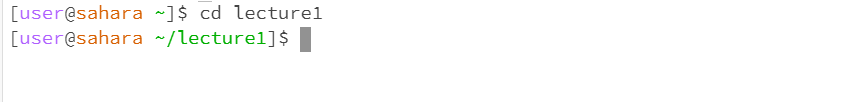
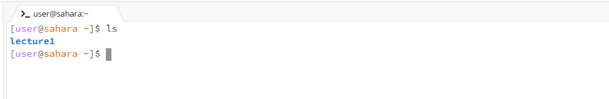
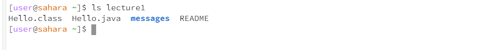
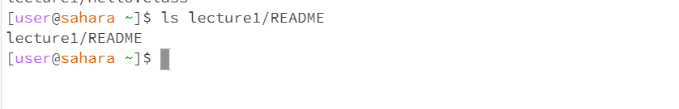
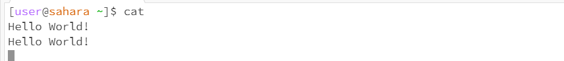
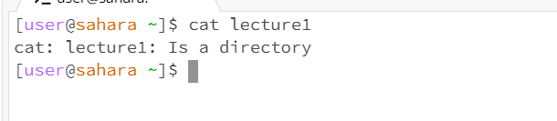
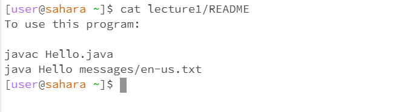

#Lab Report 1        
=========

cd: used to switch the current working directory to the given path
---------

__1.using no arguments__

- the working directory is `/home`

- there was no output, as it was only accessing the home directory. So there is no path to any of the files, so its called no argument. And no filesytem yet.

- no error

__2.using a directory as argument__

- the working directory now is `/home/lecture1`

- there was no output, as it was only accessing the `/lecture1` directory now. So now there is a argument like `lecture1`. Doing that we are able do open the folder of `lecture1` by the filesystem.

- no error

__3.using a file as arugment__

- So now we tried the argument like `README`.However, we get an error with that, because `cd` is only used to acess directory, but `README` is a file.

ls: used to list the files and folders the given path
---------

__1.using no arguments__

- the working directory is `/home`

- we get a list of the home directory `/home`, that is only the lecture1 folder

__2.using a directory as argument__

- the working directory is `/home`

- we get a list of the directory `/lecture1`, so we get the folder like messages and the file like `Hello.class`, `Hello.java`, `README`

__3.using a file as arugment__

- the working directory is `/home`

- the `README` file was the last file, so after that there is no more list, so the path was the output

cat: used to print the contents of one or more files given by the paths
---------

__1.using no arguments__

- the working directory is `/home`

- when we used `cat` everthing that we write, it will be the output

__2.using a directory as argument__

- we get an error, because `cat` use only for read the file, and `/lecture1` is a directory

__3.using a file as arugment__

- the working directory is `/home`

- its print what was written on the `README` file

