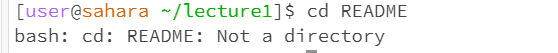

#Lab Report 1        
=========

cd: used to switch the current working directory to the given path
---------

__1.using no arguments__

- the working directory is `/home`

- there was no output, as it was only accessing the home directory

__2.using a directory as argument__

- the working directory now is `/home/lecture1`

- there was no output, as it was only accessing the lecture1 directory now

__3.using a file as arugment__

- we get an error with that, because cd is only used to acess directory, but `README` is a file

ls: used to list the files and folders the given path
---------

__1.using no arguments__

- the working directory is `/home`

- we get a list of the home directory `/home`, that is only the lecture1 folder

__2.using a directory as argument__

- the working directory is `/home`

- we get a list of the directory `/lecture1`, so we get the folder like messages and the file like `Hello.class`, `Hello.java`, `README`

__3.using a file as arugment__

- the working directory is `/home`

- the `README` file was the last file, so after that there is no more list, so the path was the output

cat: used to print the contents of one or more files given by the paths
---------

__1.using no arguments__

- the working directory is `/home`

- when we used cat everthing that we write, it will be the output

__2.using a directory as argument__

- we get an error, because cat use only for read the file, and lecture1 is a directory

__3.using a file as arugment__

- the working directory is `/home`

- its print what was written on the `README` file

