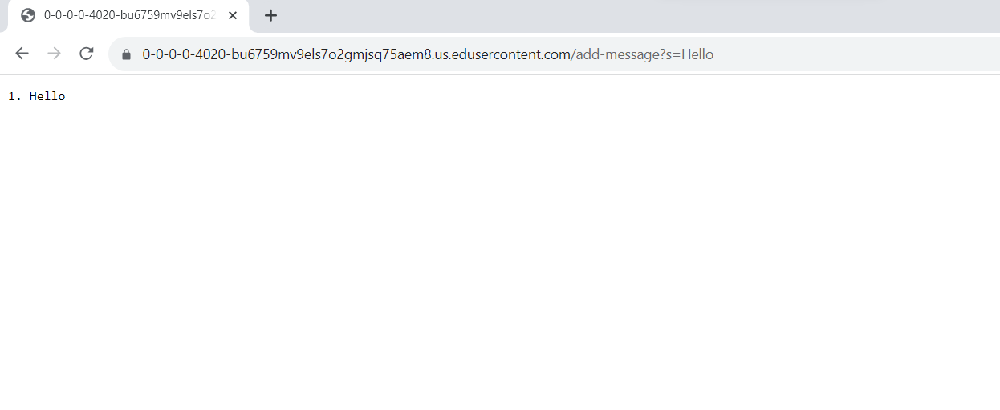
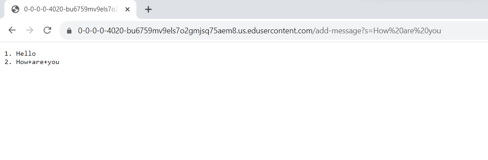
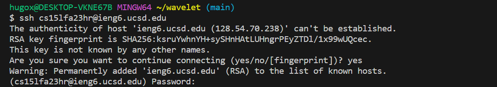
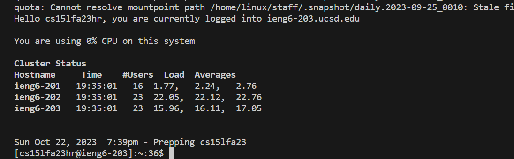
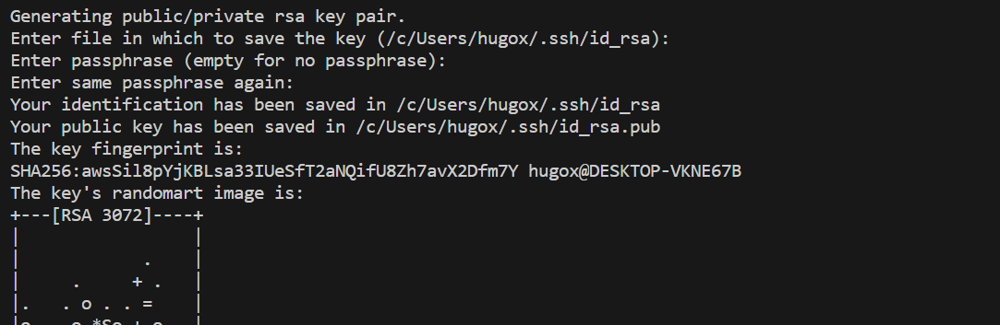
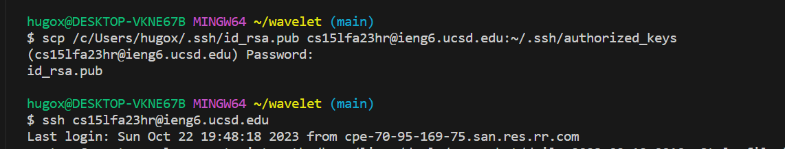
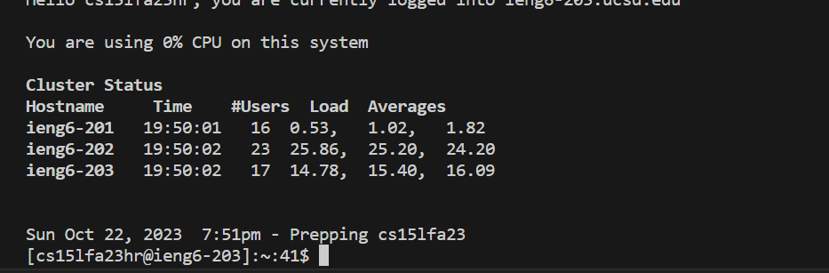
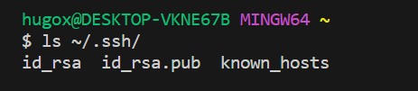
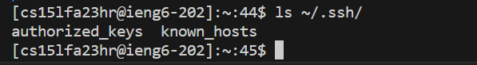

#Lab Report 2        
=========


Part 1
---------
```
import java.io.IOException;
import java.net.URI;
import java.util.ArrayList;

class Handler implements URLHandler {
    // The one bit of state on the server: a number that will be manipulated by
    // various requests.
    ArrayList<String> message = new ArrayList<String>();
    int num = 0;
    public String handleRequest(URI url)
    {
        if (url.getPath().equals("/")) 
        {
            return String.format("Number: %d", num);
        } else if (url.getPath().equals("/increment")) {
            num += 1;
            return String.format("Number incremented!");
        } else {
            if (url.getPath().contains("/add-message"))
            {
                String[] parameters = url.getQuery().split("=");
                if (parameters[0].equals("s"))
                {
                    String output = "";
                    int counter = 1;
                    message.add(parameters[1]);
                    for(int i = 0; i < message.size(); i++)
                    {
                        output += counter + ". " + message.get(i) + "\n";
                        counter++;
                    } 
                    return output;
        
                }
            }
        }
            return "404 Not Found!";
        }
    }


class NumberServer {
    public static void main(String[] args) throws IOException {
        if(args.length == 0){
            System.out.println("Missing port number! Try any number between 1024 to 49151");
            return;
        }

        int port = Integer.parseInt(args[0]);

        Server.start(port, new Handler());
    }
}
```


- Method: GET

- Arguments: `/add-message?s=Hello`

- Revelant Fields: `message` is initally empty and counter = 1

- Change in Fields: `message` becomes "1.Hello\n"

So on this example, we are using the argument `/add-message?s=Hello`, so this will make the counter be equal to 1 and it will concatenate the output of message with "1.Hello\n"



- Method: GET

- Arguments: `/add-message?s=How are you`

- Revelant Fields: `message` is "1.Hello\n" and counter = 2

- Change in Fields: `message` becomes "1.Hello\n2. How are you\n". The 1.Hello stayed, because the string concatenate with 2. How are you\n and counter will be 2

So on this example, we are using the argument `/add-message?s=How are you`, so this will make the counter of 1 to increase to 2 and it will concatenate the output of message with "2. How are you\n". So the message will become "1.Hello\n2. How are you\n"


Part 2
---------

The path to the private key for your `SSH key` for logging into ieng6 (on your computer or on the home directory of the lab computer)





The path to the public key for your `SSH key` for logging into ieng6 (within your account on ieng6)



A terminal interaction where you log into ieng6 with your course-specific account without being asked for a password.





LS

Local



The private key is usually located at 'id_rsa' and the public key is usually located at 'id_rsa.pub'

Remote



The private key is usually located at 'authorized_keys'

Part 3
---------

I learned how to use the terminal better, as well as use Visual Studio better. Furthermore, I learned how to open remote servers, and through them I can manage files on another computer, even if I'm not using that computer. And now I can open my remote server without need to put every time my password.


  


