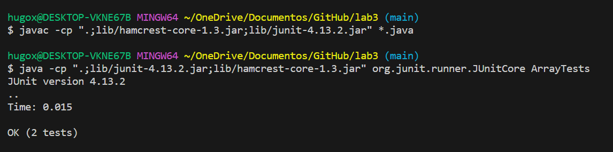
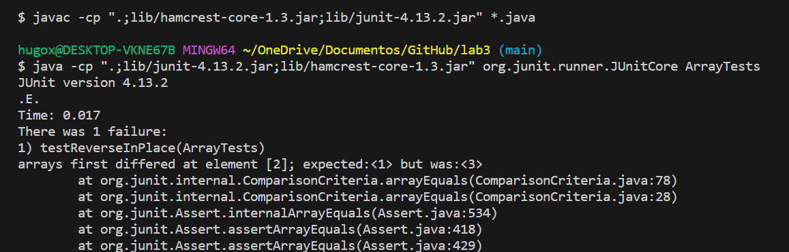
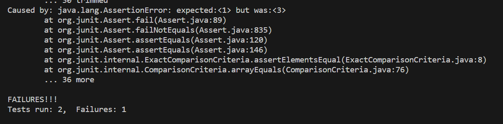
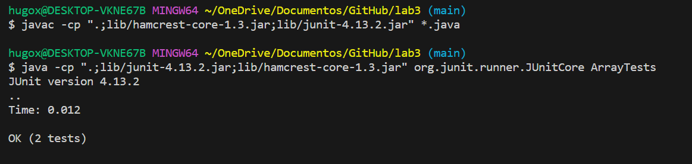
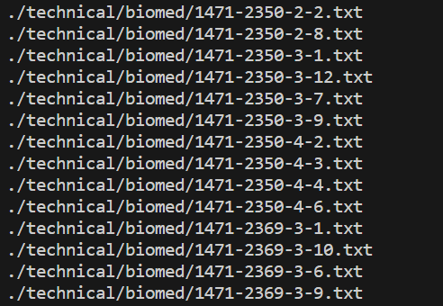
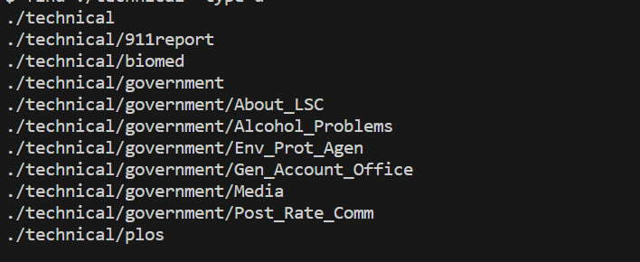
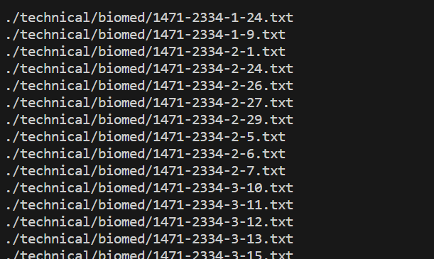
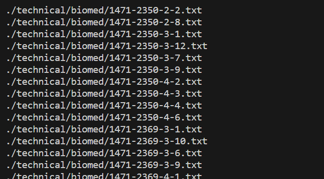

Lab Report 3

Part 1

Correct
```
public class ArrayTests {
	@Test 
	public void testReverseInPlace() {
    int[] input1 = { 3 };
    ArrayExamples.reverseInPlace(input1);
    assertArrayEquals(new int[]{ 3 }, input1);
	}
```




Wrong
```
 public class ArrayTests {
	@Test 
	public void testReverseInPlace() {
    int[] input1 = {1,2, 3 };
    ArrayExamples.reverseInPlace(input1);
    assertArrayEquals(new int[]{ 3,2,1 }, input1);
	}
```






Code before
```
public class ArrayExamples {

  // Changes the input array to be in reversed order
  static void reverseInPlace(int[] arr) {
    for(int i = 0; i < arr.length; i += 1) {
      arr[i] = arr[arr.length - i - 1];
    }
  }
```
  
Code after
```
public class ArrayExamples {

  // Changes the input array to be in reversed order
  static void reverseInPlace(int[] arr) {
    for(int i = 0; i < arr.length/2; i += 1) {
      int temp = arr[i];
      arr[i] = arr[arr.length - i - 1];
      arr[arr.length - i - 1] = temp;
    }
  }
```



The code was not storing the value within memory; the value that was supposed to be stored was being overwritten in the code. So, I created a variable to store this value, and this way, I wouldn't lose it during the code. In addition, I was making unnecessary loops; since the values are changed with each interaction, we only need to do n/2, with n being the size of the array.

Part 2

find

1: Search by File Type

example 1: Find all text files in the ./technical directory
```
find ./technical -type f -name "*.txt"
```


example 2: Find all directories in the ./technical directory
```
find ./technical -type d
```


Explanation: The -type f in Example 1 filters the search to find only files, and -type d in Example 2 finds only directories. This is useful for targeting specific file types. Depending how many directories and files you have, this can save a lot of time when you are trying to find.

Source: https://alvinalexander.com/unix/edu/examples/find.shtml

2: Search by size

example 1: Find all files larger than 1MB in the ./technical directory
```
find ./technical -type f -size +1M
```


example 2: Find all files smaller than 100KB in the ./technical directory
```
find ./technical -type f -size -100k
```


Explanation: The -size +1M in Example 3 searches for files larger than 1MB, while -size -100k in Example 4 searches for files smaller than 100KB. This is useful for filtering files based on their size. Depending how is your task, if you need to find a larger or smaller file, this will save a lot of time

Source: https://www.howtoforge.com/tutorial/linux-find-command-examples/

3: Execute Commands on Found Files

example 1: Find and delete all .bak files in the ./technical directory
```
find ./technical -type f -name "*.bak" -exec rm {} \;
```


example 2: Find and copy all .pdf files to another directory
```
find ./technical -type f -name "*.pdf" -exec cp {} /backup \;
```


Explanation: The -exec rm {} \; in Example 5 deletes found files, and -exec cp {} /backup \; in Example 6 copies found files to another directory. This is useful for performing actions on the found files

Source: https://www.tecmint.com/35-practical-examples-of-linux-find-command/

4: Search by Modification Time 

example 1: Find all files modified within the last 7 days in the ./technical directory
```
find ./technical -type f -mtime -7
```


example 2: Find all files modified more than 30 days ago
```
find ./technical -type f -mtime +30
```


Explanation: The -mtime -7 in Example 7 finds files modified within the last 7 days, and -mtime +30 in Example 8 finds files modified more than 30 days ago. This is useful for time-based searches.

Source: https://www.geeksforgeeks.org/find-command-in-linux-with-examples/

