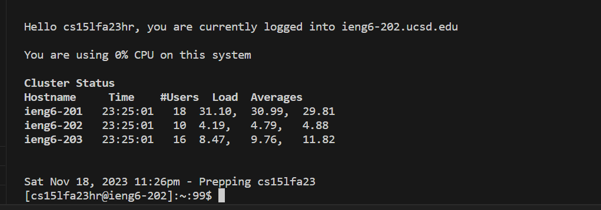
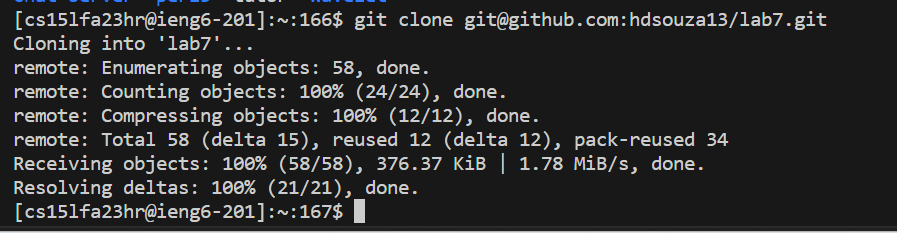
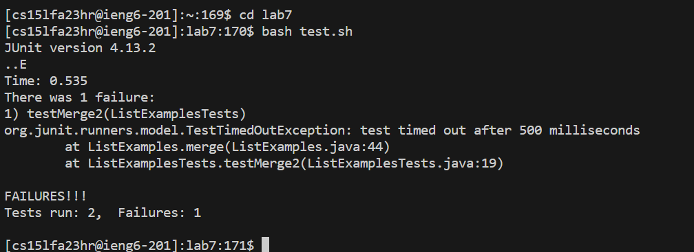
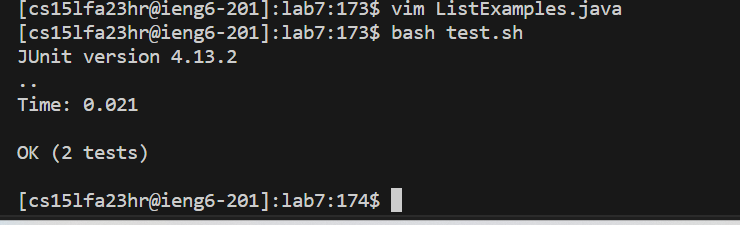
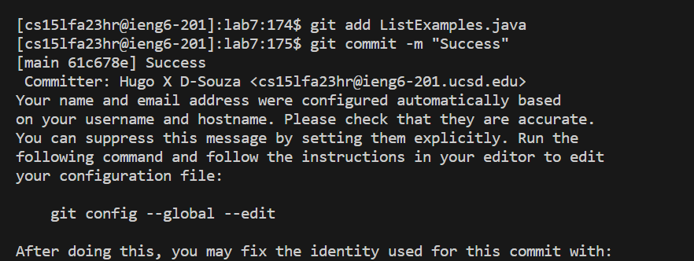
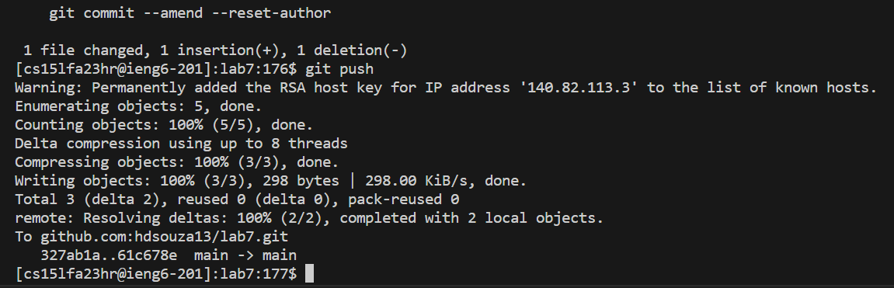

Lab 4
=========

Log into ieng6
---


```ssh<space>cs15lfa23hr@ieng6.ucsd.edu<enter>```

So I use the ssh to login in the remote server of ieng6, and I didnt need to use my password because I already setup it using the ssh-keygen, the authentication key.

Clone your fork of the repository from your Github account (using the SSH URL)
---


```git<space>clone<space>git@github.com:hdsouza13/lab7.git<enter>```

Before I do this command, I forked my github repository on my browser and copy the text as a ssh clone. So then I git clone my git hub ssh url of my github repository. 

`` cd<space>lab7<enter>```
```ls<enter>```

After I clone my repository, I used the ```cd lab ``` to set the working directory and ```ls``` to view what it is inside it

Run the tests, demonstrating that they fail
---


```bash<space>test.sh<enter>```

I run the bash test.sh to show that the code was incorrect and fail


Edit the code file ListExamples.java to fix the failing test (as a reminder, the error in the code is just that index1 is used instead of index2 in the final loop in merge)
---

```vim<space>ListExample.java```

So I used the vim command, so I can edit and correct the file, using my terminal

Inside vim
---

```/index1<enter> n ```

To go to the part that I need to fix, I first type ```/index1``` and enter to search for index1.Then I pressed n some times until I finally able to find the "index1" that need to be changed to "index2"

```e r 2<esq>:wq<enter>```

```e``` is to go to the end of the word

```r2``` replace the last character in the word to be a “2”, to make the word “index2”

```:wq<enter>``` to save my changes and exit out of vim


Run the tests, demonstrating that they now succeed
---


```bash<space>test.sh<enter>```

I run the bash test.sh to show that the code was correct and succeed

Commit and push the resulting change to your Github account
----



```git<space>add<space>ListExamples.java<enter>```

This command put my file on the stage mode

```git<space>commit<space>-m<space>"Success"<enter>```

This create commit with the message "Success"

```git<space>push<enter>```

This gonna push to my github repository
