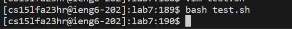
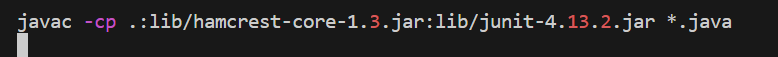
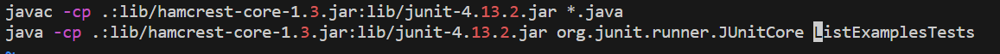
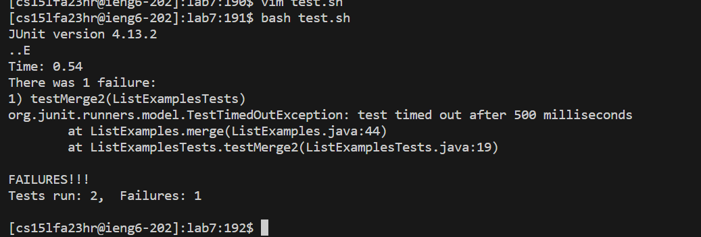
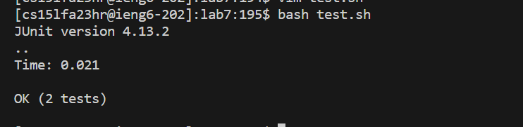

Lab 5
---

Part 1
---
Student: Hello, I'm having some problems with this project of mine.

I was trying to run my program using the bash, however it is not running and its not showing no compile error. As you can see the output is empty.



TA: Hummmmmmm. Normally when this happens, it means that the command you used was unable to find the file. Can you show me your bash file.

Student: This is what I wrote for my bash file



TA: Ohhhhh, I know your error. So normally on java programs, you need to compile the file, as you are doing using the ```javac```. However, just compiling, it is not going to run automatic your code, so you need something else to run the program.

Student: Ohhhhhh, this is true. I figure out that my code has missing the the ```java``` command to run the file.



But look when I run now I got another error.



TA: You can see that by the output error is showing it is a TestTimedoutException. So on your code, something is making it run forever, getting this error. So if you have a loop statements, you should look at it, and see if you are making it running forever.

Student: Ohhhh, I saw that my while loop was running forever, because I put the index1, instead of index2, so the loop was going forever. Now it is running very well. Thank you very much for the help.



Part 2
---
So in the second half of this quarter, I learned how to use jdb, I had no idea it existed. This will help me a lot, if my program gives an error, I can compile it and divide them into parts, to see how each part is compiling. Also I learned how to code in bash script, something very new, that I never used. And the bash helped me alot to run the programs, and saved me a lot of time. And I really liked the lab in which we created a code for autocorrection, it made me more or less see how automatic correction works.
